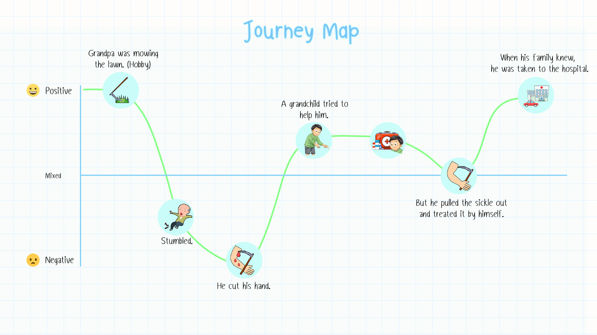

<h1 align=center>This is our first <code>Design Thinking Project</code> 💖</h1>
 

📌 **Keyword is** 🧓👵	 [***AGING SOCIETY***](https://www.fwd.co.th/th/article/health/elderly-society/)
## Processes of Design Thinking Modes
- [Empathize](#Empathize)
- [Define](#Define)
- [Ideate](#Ideate)
- [Prototype](#Prototype)
- [Test](#Test)
---

<h1 align=center id=Empathize>🤗 Empathize Mode</h1>
 

> #### Why we have to empathize?
> - หากเราไม่พยายามที่จะเข้าใจผู้อื่น เราก็ไม่มีทางที่จะรู้ความต้องการของใครเลย

 

## How we `Empathize`

### Interview script
> ### For User Persona 👴🏼
>> - คุณลุงคิดอย่างไรกับอุบัติเหตุในครั้งนี้คะ
>> - คุณลุงรู้สึกอย่างไรตอนที่ดึงที่เกี่ยวออกคะ
>> - คุณลุงคิดอย่างไรที่กำลังจะดึงที่เกี่ยวออก แล้วทำแผลด้วยตนเองคะ

> ### For Journey map📍
>> - คุณลุงเคยเกิดประสบพบเจออุบัติเหตุไหมคะ
>> - คุณลุงเคยเจอเหตุการณ์ที่ทำให้รู้สึกว่าตัวเองไม่ปลอดภัยไหมคะ
>> - การตัดหญ้าถือว่าเป็นงานอดิเรกของคุณลุงใช่ไหมคะ
>> - ตอนที่สะดุดหกล้ม คุณลุงได้เรียกคนแถวนั้นให้ช่วยไหมคะ
>> - คุณลุงดึงที่เกี่ยวออก แล้วทำแผลให้ตัวเองยังไงคะ

## 🧓 A Grandpa's Journey map (65 years old)

 

---

### What-How-Why
> | *What* | *How* | *Why* |
> |------|------|-----|
> | คุณลุงไปตัดหญ้า แล้วได้รับอุบัติเหตุ | คุณลุงหยิบที่เกี่ยวหญ้า ซึ่งในระหว่างเดินทางไปตัดหญ้า คุณลุงเกิดการสะดุดหกล้ม ทำให้ที่เกี่ยวหญ้าไปเกี่ยวโดนบริเวณแขน จนหลานมาช่วยคุณลุง และบอกคุณลุงว่าอย่าพึ่งดึงที่เกี่ยวออก แต่คุณลุงเลือกที่จะดึงที่เกี่ยวออก และทำแผลด้วยตนเอง | ในระหว่างทางเดินมันมีพื้นต่างระดับและกล้ามเนื้ออ่อนแรง ทำให้คุณลุงเกิดการสะดุดหกล้ม |

### Say / Do / Think / Feel
<!--paste the matrix pic here-->
#### Say
> - คุณลุงชอบตัดหญ้าเป็นงานอดิเรก
> - มีปัญหากล้ามเนื้อไม่แข็งแรง (ค่อนข้างผอม)
> - อยากปฐมพยาบาล ด้วยตัวเอง มากกว่า
> - คุณลุงไม่อยากเสียเงินค่าไปโรงพยาบาล
> - ไม่อยากให้ครอบครัวเป็นห่วง

#### Do
> - ปฐมพยาบาลด้วยตัวเอง (จากการหกล้มและบาดเจ็บจากของมีคม)
> - แสดงออกอย่างรู้สึก รำคาญใจ (เมื่อต้องให้ผู้อื่นช่วยเหลือ)

#### Think
> - ลุงคิดว่าการที่เราสามารถช่วยเหลือตัวเองได้ก็ช่วยเหลือตัวเองไม่อยากเป็นภาระลูกหลาน
> - ลุงคิดว่าแผลแค่นี้ไม่จำเป็นต้องไปหาหมอ
> - ลุงคิดว่าถ้าบอกครอบครัวไปจะทำให้ครอบครัวไม่อยากให้ตัดหญ้าอีก

#### Feel
> - รู้สึกขาดคุณค่าในตัวเอง ➡️ เลือกที่จะ ไม่ขอความช่วยเหลือ หรือ แก้ไขปัญหาด้วยตัวเอง
> - รู้สึกกลัว การขาดคุณค่า ➡️ ปัดป้องความรู้สึกกลัว โดยแสดงออกอย่างรำคาญใจ
> - รู้สึก ไม่อยากเป็นภาระของลูกหลาน

### Inferences as Think-Feel
> - หากมีกิจกรรมที่ทำให้คุณลุง **`รู้สึกถึงคุณค่าในตัวเอง`** (และคิดว่าตัวเองสามารถทำได้) คุณลุงก็พร้อมที่จะทำกิจกรรมนั้น
> - แต่ในบางกิจกรรมก็สามารถ **`เกิดอุบัติเหตุได้ง่าย`** และอาจอันตรายถึงชีวิต หาก **`ขาดการดูแลอย่างใกล้ชิด`**
> - คุณลุงจะรู้สึกดีมากขึ้น หากเปิดใจว่า **`ทุกคนมีขีดจำกัดในตัวเอง`** ดังนั้น **`การขอความช่วยเหลือ`** จึงเป็นส่วนหนึ่ง ที่จะทำให้เราก้าวไปข้างหน้าได้

---

<h1 align=center id=Define>🤔 Define Mode</h1>
 

> #### Why we have to define?
> - เราคงไม่สามารถแก้ปัญหาได้ ถ้ายังไม่รู้ว่าปัญหาคืออะไร

 

## How we `Define`

### User persona

 
<!--User persona image-->

---

### Identified insights
<!--For Identify-->

### PoV statement
<!--For PoV-->

---

<h1 align=center id=Ideate>💡 Ideate Mode</h1>
 

---

<h1 align=center id=Prototype>🛠️ Prototype Mode</h1>
 

---

<h1 align=center id=Test>✅ Test Mode</h1>
 

---
<!--Each team member's contribution in this assignment-->
No. | Member in PODHII (G2-10) | Github Username | Contribution
:---:|:---|:---|:---
1 | Sirapob Wuthithein | fluffyhugger | 
2 | Saksaran Akramethawong | saksaran | 
3 | Chanakan Phuatad | crocochon | 
4 | Chinnaphat Lohasangsuwan | ChinnaphatLoha | 
5 | Chanatip Insoom | chaaanatip | 
6 | Varittorn Siriwatcharakul | hutchz72 | 
