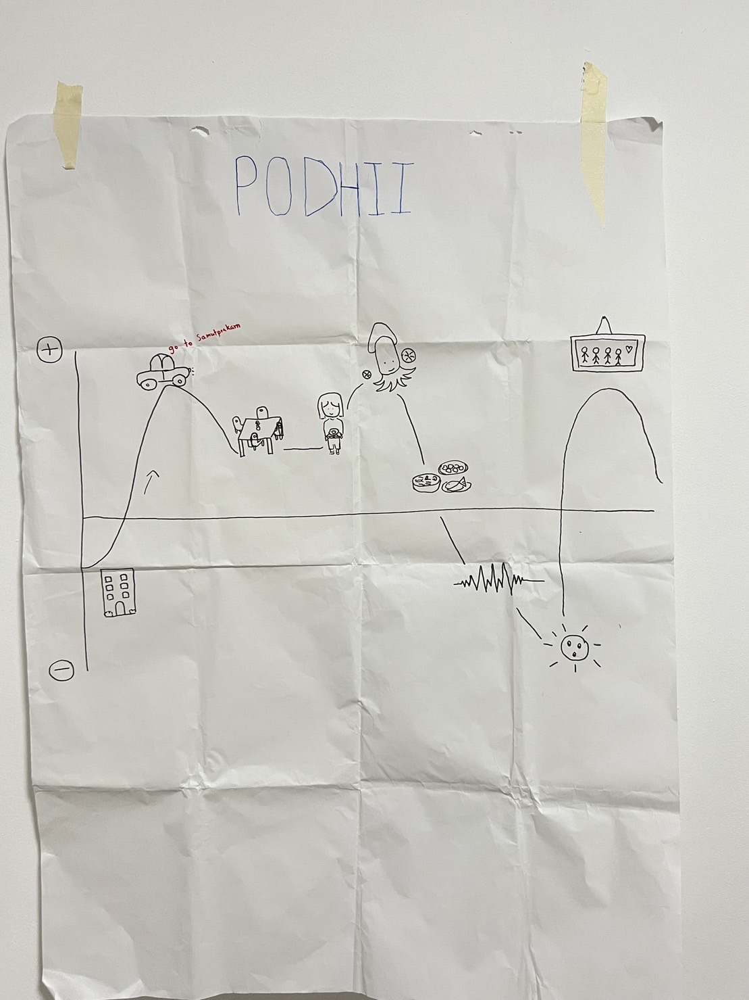

<!--Header of the Project (h1)-->
<h1 align="center">Header of the Project</h1>
<!--Name of the Story (h3)-->
<h3 align="center">Name of the Story</h3> 
<!--Questions asked during the interview-->

<!--Summary of interview as What-how-why table-->

<!--What you have inferred as Think-Feel-->
<h1>What you have inferred as Think-Feel</h1>

### THINK

 &emsp; • A คิดว่าการบริการร้านอาหารที่นี่ดีบริการเร็วและบรรยากาศดีเหมาะพาครอบครัวมาทานอาหาร

  
### FEEL

 &emsp; • A รู้สึกมีความสุขเพราะครอบครัวรับพาไปกินข้าวที่ร้านอาหาร รวมกับร้านที่บรรยากาศดีและอาหารที่อร่อย การบริการของพนักงานที่ไม่รอนานจนเกินไปทำให้ A มีความประทับใจการบริการของร้านนี้

<!--Journey map from class (ratio 11/14)-->

  

<!--Summary/lessons learned from in class presentation and feedback (I like, I wish)-->

<!--Revised Journey map, What-how-why, and/or Think-Feel-->

<!--Identified insights-->

<!--PoV statement-->

<!--Each team member's contribution in this assignment-->
No. | Member in PODHII (G2-10) | Github Username | Contribution
:---:|:---|:---|:---
1 | Sirapob Wuthithein | fluffyhugger | **Contribution**
2 | Saksaran Akramethawong | saksaran | **Contribution**
3 | Chanakan Phuatad | crocochon | **Contribution**
4 | Chinnaphat Lohasangsuwan | ChinnaphatLoha | **Contribution**
5 | Chanatip Insoom | chaaanatip | **Contribution**
6 | Varittorn Siriwatcharakul | hutchz72 | **Contribution**
