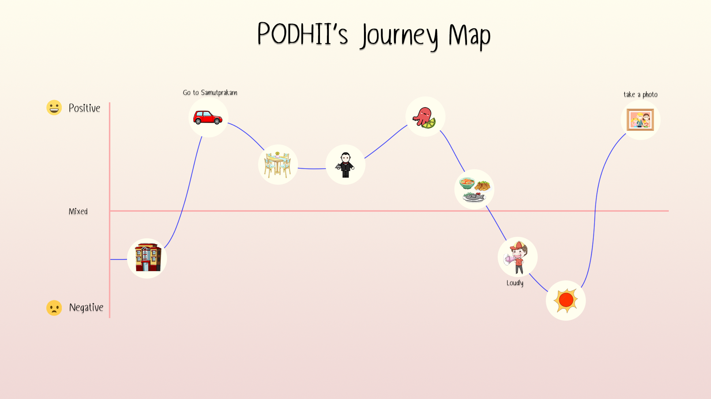

<!--Header of the Project (h1)-->
<h1 align="center">Design Thinking homework on Empahtize and Define</h1>
<!--Name of the Story (h3)-->
<h3 align="center"><a href="https://github.com/ChinnaphatLoha/g2-10-PODHII/issues/46#issue-1376804920">เหตุการณ์ทานข้าวในช่วงยุค CoVid-19</a></h3> 
<!--Questions asked during the interview-->

<h2 align='center'>🎙️หัวข้อสัมภาษณ์🎙️</h2>

> - _ทำไมแดมถึงเลือกไปร้านอาหารนั้น_
>
> - _ระหว่างทางที่พ่อแม่ขับรถรู้ไหมว่าจะไปกินร้านอาหารร้านไหน_
>
> - _ร้านอาหารทีแดมไปกินมีข้อเสียและข้อดีอะไรบ้างไหม_
>
> - _เมนูไหนอร่อยที่สุดทีแดมกินแล้วชอบ_
>
> - _บรรยากาศในร้านเป็นอย่างไรบ้าง_
>
> - _Impressionให้ร้านนี้อาหารมีด้านไหนบ้าง_
>    - _First Impression ของร้านนี้เป็นอย่างไรบ้าง_
>
> - _หลังจากทานอาหารเสร็จแดมไปไหนต่อ_
>
> - _หลังจากทานอาหารร้านนี้เสร็จอยากจะไปทานอีกรอบไหม_

---
<!--Summary of interview as What-how-why table-->
## _🔸What-How-Why Table_ 🚗💨
__What__ | __How__ | __Why__ |
:---|:---|:---|
แดมไปทานข้าวโดยที่ไม่รู้ว่าจะทานร้านที่ไหน | ครอบครัวมารับไปทานข้าว ขับรถมาเรื่อยๆจนเข้าเขตจังหวัดสมุทรปราการ และได้เจอร้านอาหารแถวนั้น | เลือกร้านอาหารนี้เพราะบรรยากาศดี |
---
<!--What you have inferred as Think-Feel-->
## What you have inferred as Think-Feel 💙

### THINK 💜

 &emsp; • A คิดว่าการบริการร้านอาหารที่นี่ดีบริการเร็วและบรรยากาศดีเหมาะพาครอบครัวมาทานอาหาร

 &emsp; • A คิดว่าโต๊ะข้าง ๆ ที่เสียงดังนั้นไม่ได้เกรงใจลูกค้าคนอื่น ๆ ในร้านอาหาร

 &emsp; • A คิดว่าถ้าร้านอาหารมีที่กันแดด หรือโต๊ะถูกจัดให้แดดส่องไม่ถึงก็จะดีมาก ๆ

  
### FEEL 🤎

 &emsp; • A รู้สึกมีความสุขเพราะครอบครัวรับพาไปกินข้าวที่ร้านอาหาร รวมกับร้านที่บรรยากาศดีและอาหารที่อร่อย การบริการของพนักงานที่ไม่รอนานจนเกินไปทำให้ A มีความประทับใจการบริการของร้านนี้

 &emsp; • A รู้สึกไม่พอใจและค่อนข้างหงุดหงิดกับเสียงรบกวนจากโต๊ะข้าง ๆ และแสงแดดที่ส่องเข้ามาตลอดเวลาขณะทานอาหาร

<!--Journey map from class (ratio 11/14)-->
<h2 align="center">This is the <em><b>Journey map</b></em> from class</h2>
<h3 align="center">👇 click an image to enlarge 👇</h3>
 

  

---
<!--Summary/lessons learned from in class presentation and feedback (I like, I wish)-->
## 💬 Feedbacks from class (I like, I wish)

 

😍 I like | 🤔 I wish
------|------
คิดภาพตามได้ เข้าใจเรื่องราวได้ง่าย | **ปรัปรูปวาดให้เข้าใจได้ง่ายขึ้น**
รูปวาดน่ารัก | **เล่ารายละเอียดของเรื่องราวเพิ่ม**
ใช้นํ้าเสียงในการเล่าได้ดี | **เพิ่มสีสันในภาพ**

 

---
<!--Revised Journey map, What-how-why, and/or Think-Feel-->
<h2 align="center">This is the <em><b>Revised Journey map</b></em> from class</h2>
<h3 align="center">👇 click an image to enlarge 👇</h3>
 

  

## _💞What-How-Why Table (Journey Map)💞_

| What | How | Why |
|:----|:----|:----|
|ปรับปรุงในส่วนของรูป | ปรับปรุงในส่วนของรูปภาพให้มีความชัดและเข้าใจง่ายมากขึ้น | ในส่วนของรูปยังสื่อได้ไม่ชัดเจน |
|ใส่คำอธิบายในรูปและเพิ่มสีสันให้กับรูปภาพ | ใส่คำอธิบายในบางส่วนของรูปและเพิ่มสีสันของรูปภาพ | ยากต่อการทำความเข้าใจในส่วนของรูปและยังไม่มีความน่าสนใจ |

---
<!--Identified insights-->
 
## Insight 🙋

> ### เสียงดังจากโต๊ะข้าง ๆ และแดดร้อน 😤
> - อยากให้ช่วงเวลาที่ได้มาทานอาหารกับครอบครัวนั้นมีบรรยากาศที่ดีกว่านี้ ไม่มีเสียงรบกวน และแสงแดด
 
---
<!--PoV statement-->
## PoV statement 🧐
> 1) นาย A เป็นหนุ่มนักศึกษา IT KMUTT ปี 1 ตอนนี้พักอยู่ที่หอนอก U Resident ถนนพุทธบูชา เขาเป็นคนที่มีอารมณ์ขัน เต็มที่กับการทำงาน และยังมีความสุขุมอีกด้วย
> 2) ถึงแม้บรรยากาศจะแย่ลงเพราะ เจอแดดร้อนและเสียงดังจากโต๊ะข้าง ๆ นาย A ก็ตัดสินใจที่จะนั่งอยู่เฉย ๆ
> 3) นาย A คิดว่าถ้ามีปากเสียงจะเกิดปัญหามากขึ้น ทำให้เสียบรรยากาศมากกว่าเดิม และไม่สามารถย้ายไปโต๊ะอื่นได้ จึงนั่งอยู่เฉย ๆ และใช้เวลาอยู่กับครอบครัว
> 4) ถามพนักงานว่าสามารถย้ายโต๊ะที่นั่งได้ไหม และบอกเหตุผล
---
<!--Each team member's contribution in this assignment-->
No. | Member in PODHII (G2-10) | Github Username | Contribution
:---:|:---|:---|:---
1 | Sirapob Wuthithein | fluffyhugger | **ทำคำถามสัมภาษณ์, Insights, PoV**
2 | Saksaran Akramethawong | saksaran | **วาดรูป Journey map ver.ปรับปรุง, Insights, PoV**
3 | Chanakan Phuatad | crocochon | **ทำตาราง what-how-why (Empathize), Insights, PoV**
4 | Chinnaphat Lohasangsuwan | ChinnaphatLoha | **ทำ template, สรุป I like&I wish, Insights, PoV**
5 | Chanatip Insoom | chaaanatip | **ทำอนุมาน think-feel, Insights, PoV**
6 | Varittorn Siriwatcharakul | hutchz72 | **ทำตาราง what-how-why (Journey map), Insights, PoV**
